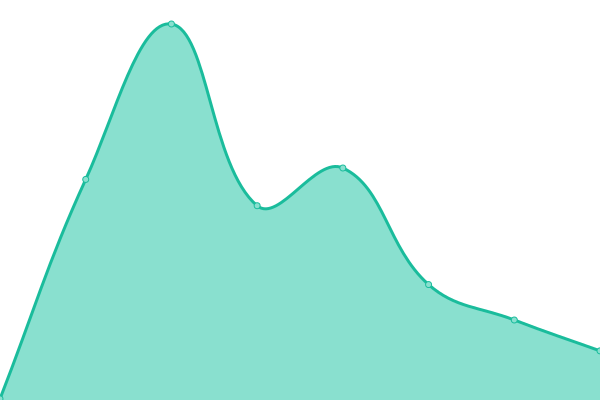

# [📈 Live Status](https://breuer.dev): <!--live status--> **🟧 Partial outage**

This repository contains the open-source uptime monitor and status page for [Felix Breuer](https://breuer.dev), powered by [Upptime](https://github.com/upptime/upptime).

With [Upptime](https://upptime.js.org), you can get your own unlimited and free uptime monitor and status page, powered entirely by a GitHub repository. We use [Issues](https://github.com/breuerfelix/upptime/issues) as incident reports, [Actions](https://github.com/breuerfelix/upptime/actions) as uptime monitors, and [Pages](https://breuer.dev) for the status page.

<!--start: status pages-->
<!-- This summary is generated by Upptime (https://github.com/upptime/upptime) -->
<!-- Do not edit this manually, your changes will be overwritten -->
<!-- prettier-ignore -->
| URL | Status | History | Response Time | Uptime |
| --- | ------ | ------- | ------------- | ------ |
|  [breuer](https://breuer.dev) | 🟩 Up | [breuer.yml](https://github.com/breuerfelix/upptime/commits/HEAD/history/breuer.yml) | 

 101ms
     
 | 

<a href="https://breuerfelix.github.io/upptime/history/breuer">100.00%</a>
    

|  [danielkueffler](https://danielkueffler.de) | 🟩 Up | [danielkueffler.yml](https://github.com/breuerfelix/upptime/commits/HEAD/history/danielkueffler.yml) | 

 935ms
     
 | 

<a href="https://breuerfelix.github.io/upptime/history/danielkueffler">100.00%</a>
    

|  [lychee](https://photos.felixbreuer.me) | 🟥 Down | [lychee.yml](https://github.com/breuerfelix/upptime/commits/HEAD/history/lychee.yml) | 

 0ms
     
 | 

<a href="https://breuerfelix.github.io/upptime/history/lychee">0.00%</a>
    

<!--end: status pages-->

[**Visit our status website →**](https://breuer.dev)

## 📄 License

- Powered by: [Upptime](https://github.com/upptime/upptime)
- Code: [MIT](./LICENSE) © [Felix Breuer](https://breuer.dev)
- Data in the `./history` directory: [Open Database License](https://opendatacommons.org/licenses/odbl/1-0/)
